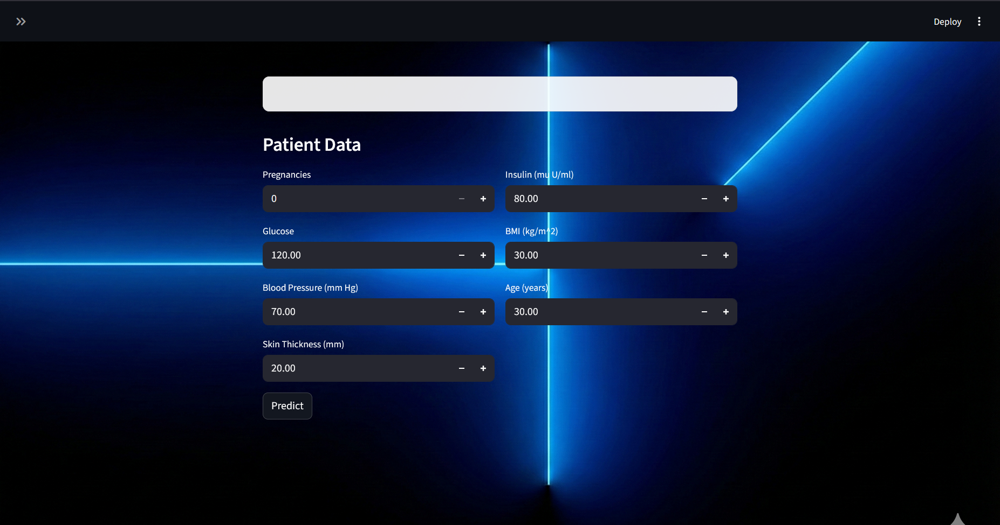
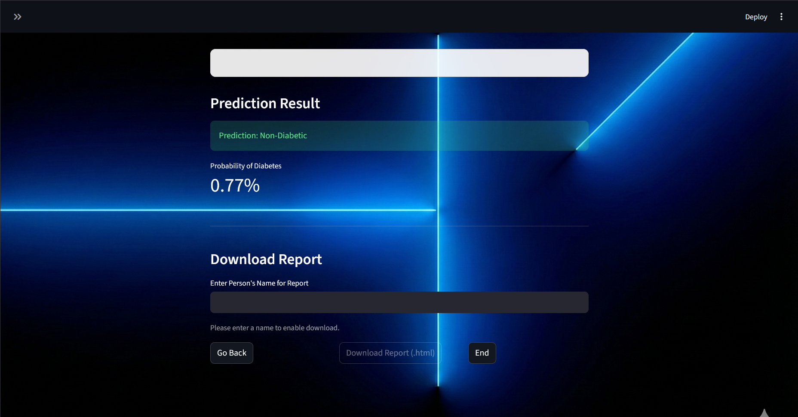
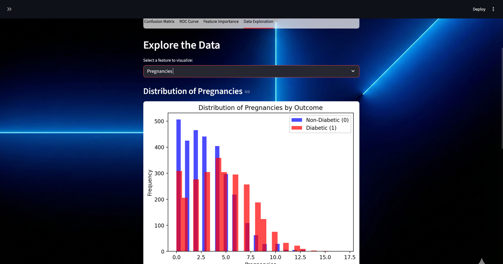
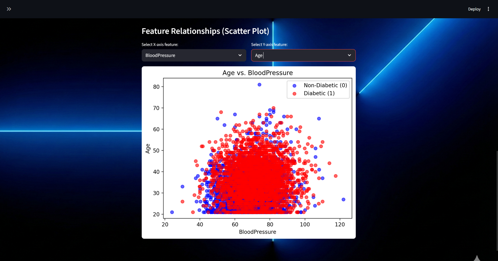
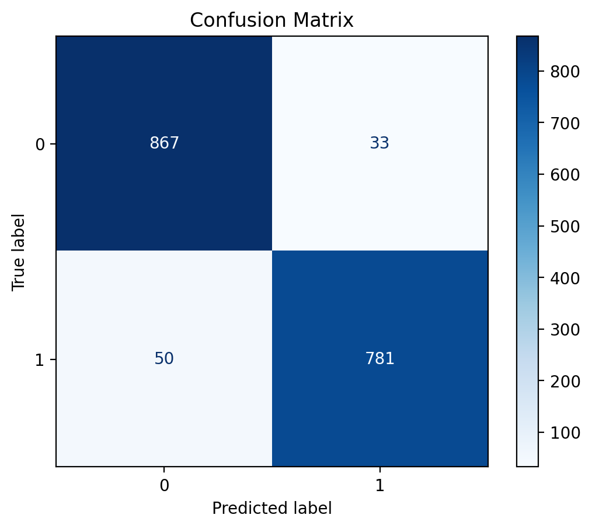
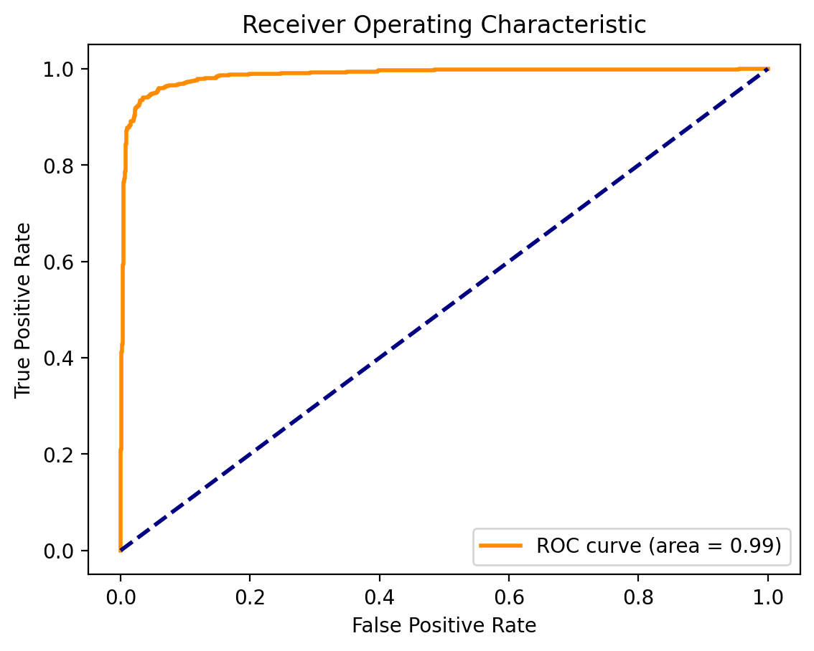
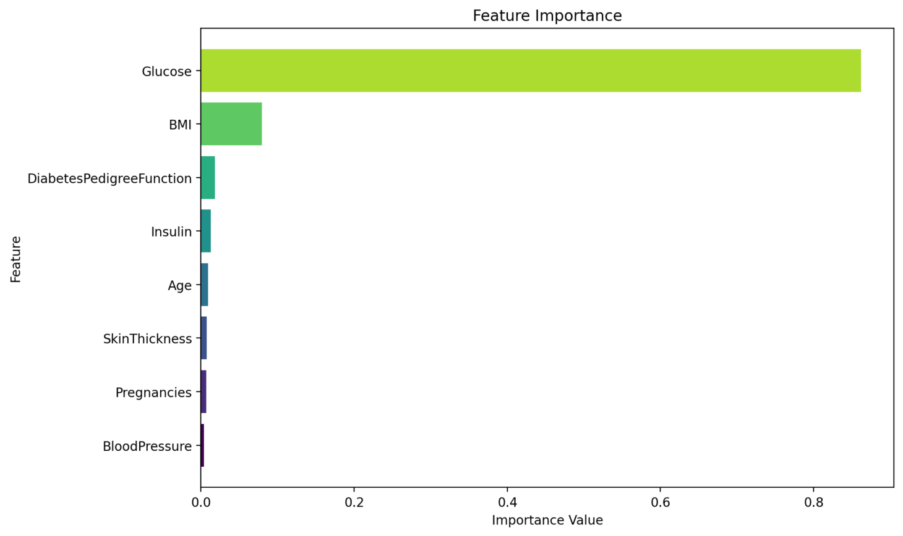
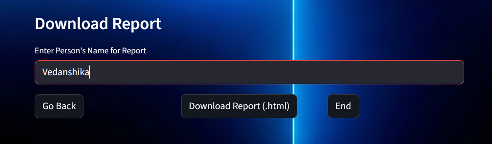
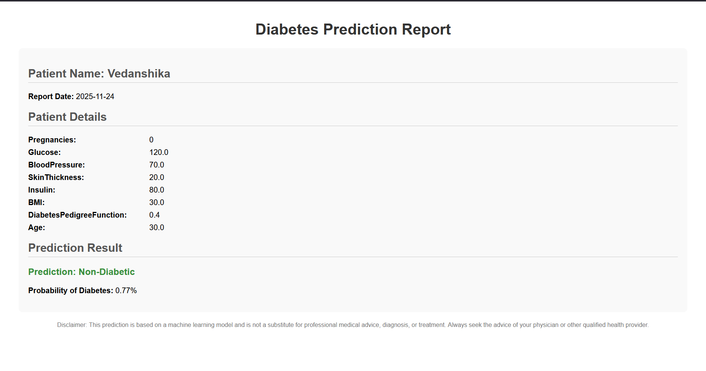

# Diabetes Prediction App

## **Project Title**

**Diabetes Prediction Web Application using Machine Learning**

### Student Information

- Name: VEDANSHIKA SINGH
- Reg No.: 25BAI10612
- Course: INTRODUCTION TO PROBLEM SOLVING AND PROGRAMMING   
- Domain: Healthcare, Machine Learning & Prediction
- GitHub Link: https://github.com/vedanshikas/VITyarthi
- Live Project Link: https://vedica-vityarthi.streamlit.app/

---

## **Overview of the Project**

This project is a web-based diabetes prediction tool built with **Streamlit**.  
It loads a trained machine learning model and allows users to enter basic clinical information (such as glucose level, BMI, age, etc.) to predict whether a person is likely to be **Diabetic** or **Non-Diabetic**.

The app includes:

- Model accuracy display  
- Confusion matrix, ROC curve, feature importance visualizations  
- Interactive data exploration  
- HTML report download feature for prediction results  

---

## **Features**

- **Interactive Streamlit UI**
  - Multiple interface pages (main page, input form, prediction result)

- **Prediction System**
  - Accepts: Pregnancies, Glucose, Blood Pressure, Skin Thickness, Insulin, BMI, Age  
  - Outputs:  
    - **Diabetic / Non-Diabetic**  
    - **Probability score (%)**

- **Downloadable Report**
  - Generates an HTML prediction report with:
    - Patient name
    - Input data
    - Prediction result & probability
    - Disclaimer

- **Visualization Tools**
  - Confusion matrix  
  - ROC curve  
  - Feature importance chart  
  - Data exploration (histograms, scatter plots)

- **Model Training Pipeline**
  - GradientBoostingClassifier  
  - Preprocessing with:
    - Median imputation  
    - Standard scaling  
  - GridSearchCV hyperparameter tuning  
  - Model saved/loaded via `joblib`

- **UI Customization**
  - Optional background image  
  - Toggle to enable/disable data exploration charts  

---

## **Technologies / Tools Used**

- **Language**
  - Python 3

- **Libraries**
  - Streamlit  
  - pandas  
  - scikit-learn  
  - matplotlib  
  - joblib  

- **Dataset**
  - `diabetes.csv` containing:
    - Pregnancies, Glucose, BloodPressure, SkinThickness, Insulin, BMI, DiabetesPedigreeFunction, Age, Outcome  

---

## **Steps to Install & Run the Project**

### **1. Clone the Repository**
```bash
git clone https://github.com/vedanshikas/VITyarthi.git
cd <your-repo-folder>
```

### **2. (Optional) Create & Activate a Virtual Environment**
```bash
# Linux / macOS
python -m venv venv
source venv/bin/activate

# Windows
python -m venv venv
venv\Scripts\activate
```

### **3. Install Required Packages**
```bash
pip install -r requirements.txt
```

### **4. Ensure Dataset is Present**
Make sure `diabetes.csv` exists in the project root directory.

### **5. (Optional) Train the Model**
If you want to retrain the model:

```bash
python train.py
```

This will:

- Load `diabetes.csv`  
- Preprocess data  
- Train Gradient Boosting model  
- Save `diabetes_model.joblib`

### **6. Run the Web App**
```bash
streamlit run app.py
```

---

## **Instructions for Testing**

### **A. Functional UI Testing**

1. Launch using `streamlit run app.py`  
2. Verify:
   - Model accuracy appears  
   - Confusion matrix & ROC curve tabs work  
   - Feature importance chart loads  

3. Click **Start Prediction**:
   - Fill out patient data  
   - Submit the form and verify prediction  

4. On result page:
   - Confirm predicted label  
   - Confirm probability value  

### **B. HTML Report Testing**

1. After prediction, enter a patient name  
2. Click **Download Report (.html)**  
3. Check:
   - Inputs match  
   - Prediction & probability correct  
   - Date & disclaimer present  

### **C. Data Exploration Testing**

1. Enable Data Exploration (via sidebar)  
2. Test:
   - Histograms by outcome  
   - Scatter plots for selected features  

### **D. Model Behavior Testing**

1. Delete `diabetes_model.joblib`  
2. Run `python train.py`  
3. Relaunch app and check:
   - Accuracy changes  
   - Predictions still functional  

---

## **Screenshots**

### Home Page


### Prediction Form


### Prediction Result


### Data Exploration


### Feature Relation


### Confusion Matrix


### ROC Curve


### Feature Importance


### Download Report


### Downloaded Report


---


